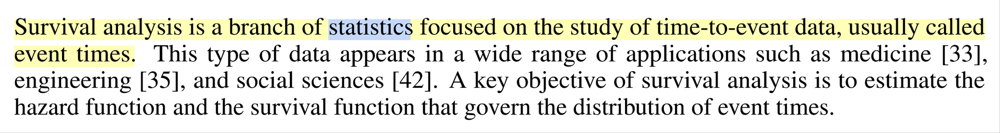
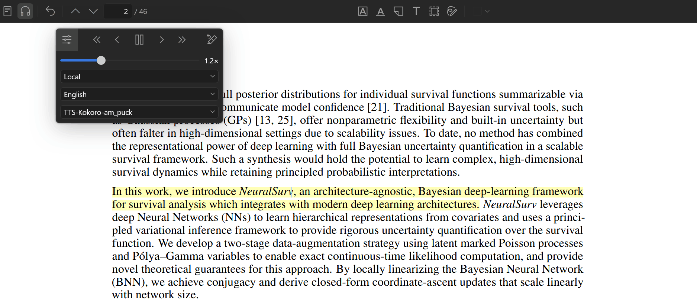
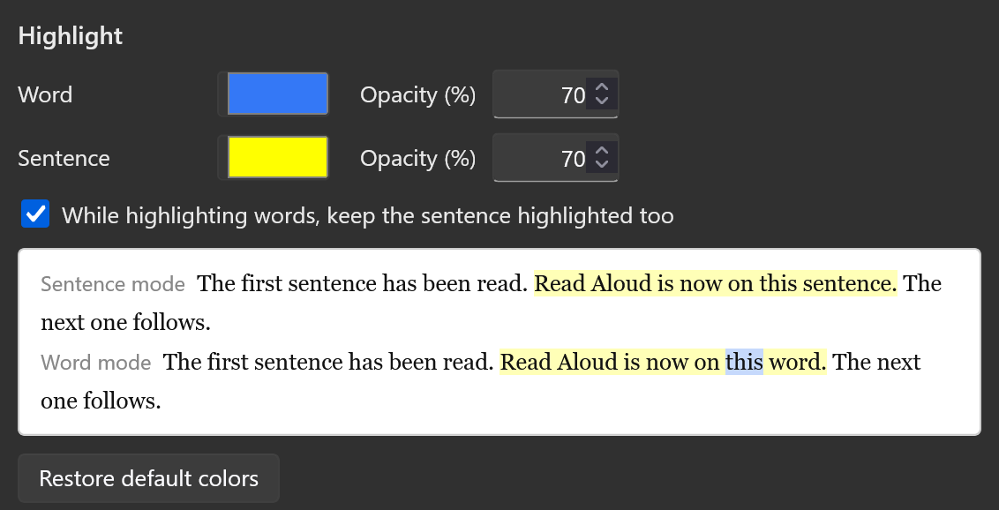
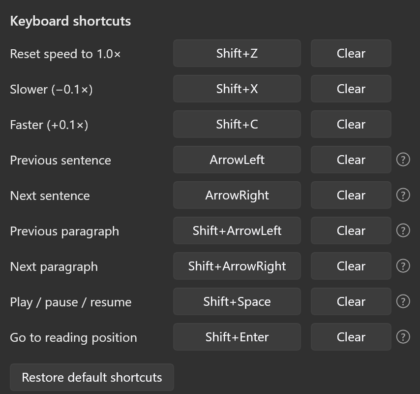
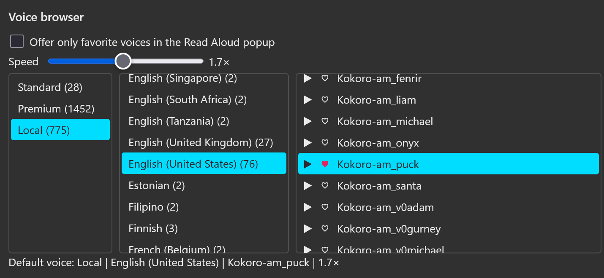

<h1 align="center">Zotero TTS</h1>

<p align="center"><em>An enhancer for Zotero 10's Read Aloud: more voices in its Local tier, word-and-sentence highlighting in your colors, keyboard shortcuts.</em></p>

<p align="center">
  <a href="https://www.zotero.org"></a>
  <a href="https://github.com/xujialiu/Zotero-TTS/releases/latest"></a>
  <a href="https://github.com/xujialiu/Zotero-TTS/releases"></a>
  <a href="https://github.com/xujialiu/Zotero-TTS/commits/main"></a>
  <a href="LICENSE"></a>
</p>

<p align="center"></p>

## What is this?

Zotero 10 reads documents aloud on its own. This plugin does not replace
that — it enhances it. Zotero keeps doing the reading: the player, the
sentence segmentation, the skip buttons, the highlighting, its Standard and
Premium voices. The plugin adds voices to its Local tier and adjusts a few
things around the edges. Why it is built this way: [PHILOSOPHY.md](PHILOSOPHY.md).

## What it adds

- 🗣️ **More voices in the Local tier** of the Read Aloud popup — Azure Speech, a [Kokoro-FastAPI](https://github.com/remsky/Kokoro-FastAPI) on your machine, OpenAI or any OpenAI-compatible server — next to Zotero's Standard and Premium voices. [→ Providers](#providers)
- 🔖 **Resume where you stopped** — close a document, open it again later, press `Shift+Space`, and Read Aloud starts at the sentence you left off on. [→ Resume where you stopped](#resume-where-you-stopped)
- 🎧 **A voice browser** in the settings: every voice by tier and language — yours and Zotero's own — a play button for a short sample, hearts for favorites, and a switch to offer only the favorites. [→ Voice browser](#voice-browser)
- ✨ **Word *and* sentence highlighting at once**, in your own colors and opacities — for Zotero's voices too. [→ Highlight](#highlight)
- ⌨️ **Keyboard shortcuts**: speed up, down, reset; jump by sentence or paragraph; read from the selection; bring the view back to what's being read. All rebindable. [→ Shortcuts](#keyboard-shortcuts)
- 📌 **One voice and speed everywhere** — every document and every open tab, picked in any popup or in the voice browser — instead of Zotero's choice per language. [→ Reading](#reading)
- 💾 **Settings backup** to a file or a WebDAV folder. [→ Backup](#backup)

## Install

Download `zotero-tts.xpi` from the [latest release](https://github.com/xujialiu/Zotero-TTS/releases/latest)
(Firefox: right-click → *Save Link As…*), install it with **Tools → Plugins → ⚙ →
Install Plugin From File…** and restart Zotero; then enable a provider in
**Edit → Settings → TTS** and pick a `TTS-…` voice under the **Local** tier.

<p align="center"></p>

## Providers

| Provider | What you need | Cost | Highlighting |
|---|---|---|---|
| **Azure Speech** | Speech resource key + region · [tutorial](tutorials/azure-speech-free-tier.md) | Free tier: 500,000 characters a month | word |
| **Kokoro-FastAPI** | A server on your machine or LAN · [tutorial](tutorials/kokoro-fastapi.md) | Free; CPU works, a GPU is faster | word |
| **OpenAI-compatible** | Base URL and model; an API key if the server wants one | OpenAI bills per character; self-hosted servers such as [Chatterbox](tutorials/chatterbox-tts-server.md) are free | sentence |

Each provider section ends with **Enable**: it runs the connection check,
and only a check that passes switches the provider on. While a provider is
on, its fields are locked — **Disable** to edit them. **Test connection**
probes without switching anything on.

API keys are stored in Zotero's preferences in plain text, like every
plugin setting, and go into the settings backup file.

<details>
<summary><b>OpenAI-compatible servers: the fields</b></summary>

The **Server** dropdown names the server — *OpenAI*, *Chatterbox-TTS-Server*,
or *Other OpenAI-compatible server* — and fills in the address and model,
graying out the fields that server ignores. **Base URL** is the server, with
or without `/v1`. **Model** is the name it expects; **Test connection**
fetches the server's model list and says whether yours is on it. Leave
**Voices** empty to take the voices the server publishes on
`/v1/audio/voices`, or list voice ids yourself, comma-separated. The API key
may stay empty for servers that have none; only api.openai.com insists on
one. For Kokoro use the *Local engine* section instead: that is what gets
you word-level highlighting.

</details>

<details>
<summary><b>Behind a gateway (Cloudflare Tunnel, reverse proxy)</b></summary>

Put the gateway's headers in **Extra headers** — of the OpenAI section, or
of the Local engine section for Kokoro — as `Name: value` pairs separated
by `;`, for example `CF-Access-Client-Id: …; CF-Access-Client-Secret: …`.
They go out with every request. [Tutorial](tutorials/remote-access-cloudflare.md).

</details>

## Settings

Everything is under **Edit → Settings → TTS**.

### Highlight

<p align="center"></p>

A color and an opacity for the word and for its sentence, and a switch to
keep the sentence highlighted under the word — for Zotero's own voices too.
Word-by-word highlighting also needs Zotero's own switch: **Settings →
General → Read Aloud → Highlight current → Word**.

<details>
<summary><b>Details</b></summary>

The preview is painted in your reader's theme. The default is a blue word
on a yellow sentence, both at 70 %; *Restore default colors* brings it back
(Zotero's own blue is `#4072e5` at 45 % and 30 %).

</details>

### Keyboard shortcuts

<p align="center"></p>

`Shift+Space` is the one play key and always does the right thing: it
pauses and resumes an open session, and otherwise starts reading — from the
selected text, from where you last stopped (below), or from the visible
page. The arrow keys and `Shift+Enter` act only while Read Aloud is open
and page or scroll as usual otherwise. Click a field to record another key.

### Resume where you stopped

Close a document in the middle of listening, open it again later, press
`Shift+Space` — Read Aloud starts at the sentence you left off on. If the
document has never been read aloud, it simply starts from the page you are
looking at.

<details>
<summary><b>Details</b></summary>

- Zotero remembers a reading position of its own, but drops it as soon as
  you scroll a few pages away from it. This one is kept.
- Reading resumes at the **start** of the sentence you were in the middle of.
- The last 50 documents, **on this computer only** — not synced between
  machines, and not part of the [settings backup](#backup).
- Nothing is drawn in the document and nothing is added to your annotations.

</details>

### Voice browser

<p align="center"></p>

Every voice Read Aloud can use, in the popup's own three steps — tier,
language, voice. **▶** plays a short sample, **♥** marks a favorite, and a
click on a row makes that voice the **default**: what Read Aloud starts
with, in every document. The **Speed** slider is the popup's own (0.5×–3×).

<details>
<summary><b>Favorites, samples, the default voice</b></summary>

- **Local** holds the voices your enabled providers publish, **Standard**
  and **Premium** are Zotero's own; multilingual voices sit under "Multiple
  languages", first in the language column. The language column is the
  popup's own dropdown for the tier — the same entries, named the same way.
- **▶** — your voices speak a sentence in the voice's own language,
  synthesized by your provider like any sentence; Zotero's voices speak
  Zotero's own sample, which spends no credits.
- *Offer only favorite voices* trims the Read Aloud popup to the marked
  ones **in every tier** — a tier you marked nothing in comes up empty, and
  Zotero grays it out. With nothing marked at all, or when none of the
  marked voices is listed any more, everything is offered again. While the
  switch is on, only a favorite can be the default. Favorites travel with
  the settings backup.
- The status line names the default by tier, language and voice with the
  speed (`Default voice: Local | Chinese | Azure-晓晓 | 1.8×`); a click on
  the default row clears it, back to Zotero's own per-language choice. Pick
  another voice in any tab's popup while the settings are open and the
  highlight moves there.
- The **Speed** slider plays the samples at that speed, and releasing it
  makes that the speed Read Aloud starts with — at once in a document that
  is playing. Zotero stretches its audio, pitch kept, so the slider costs
  no new request.
- While Read Aloud is open in some tab, adding a voice — marking a favorite
  with *Offer only favorite voices* on, or enabling a provider — is refused
  with a message naming the tabs: close them, then try again. Zotero has no
  way to refresh an open popup's list.

</details>

### Reading

- *Use one voice everywhere* — one voice for every document and every open
  tab, whatever the document's language. Off, Zotero remembers a voice per
  document language.
- *Use one speed everywhere* — one speed for every document and every open
  tab, set from the popup's slider, the shortcuts or the settings slider.
  Off, Zotero keeps a speed per document language.
- *Hide Zotero's own Local voices* — the Local tier then offers only the
  plugin's entries, which drop their `TTS-` prefix.
- *Cache synthesized audio* — skipping back or reopening a document costs no
  new request.

<details>
<summary><b>Details</b></summary>

Pick the one voice in the popup of any tab and every other tab that is
reading goes on with it from its current sentence; the rest get it when
their popup opens. The popup of a document in another language is switched
to the voice's language (a Chinese PDF reads with your English voice, its
sentences split by English rules); multilingual voices (Azure's, OpenAI's)
sit under the popup's "Multiple languages" entry, which the plugin pins to
the top of the language list. *Hide Zotero's own Local voices* takes effect
the next time the Read Aloud popup opens.

</details>

### Backup

*Backup settings…* and *Restore settings…* use a JSON file; *Upload to
WebDAV* and *Download from WebDAV* use the same file in a WebDAV folder, so
settings follow you between machines.

<details>
<summary><b>WebDAV URL examples</b></summary>

The URL is a folder, created on the first upload. Nextcloud:
`https://cloud.example.com/remote.php/dav/files/<user>/zotero-tts/`;
Jianguoyun: `https://dav.jianguoyun.com/dav/zotero-tts/` with an app
password.

</details>

## Troubleshooting

<details>
<summary><b>Common problems</b></summary>

- **"Local TTS server is not running at that address."** The server is down
  or listening elsewhere — `docker ps` should list it; see its tutorial.
- **Voices play but nothing is highlighted word by word.** Set *Settings →
  General → Read Aloud → Highlight current* to **Word**, and use a voice
  that reports word timings (Azure, Kokoro).
- **"An unknown error occurred" part-way through a document** with an
  OpenAI-compatible server: the server failed on one segment; check its log.
- **The `TTS-…` voices are missing after a Zotero update.** Read Aloud has
  no plugin API, so the plugin hooks Zotero's internal interface per reader
  tab and an update can drop its voices until the plugin catches up
  (Zotero's own keep working). Open an
  [issue](https://github.com/xujialiu/Zotero-TTS/issues) with the Zotero
  version.

</details>

## Compatibility

- Zotero 10 on the desktop, pinned to `10.*`. In use on Windows and macOS;
  Linux should be the same, but is untested.

## Development

```
npm install
npm test          # vitest, also builds build/zotero-tts.xpi
npm run typecheck
npm run build
```

[notes/NOTES.md](notes/NOTES.md) records the Zotero internals the plugin relies on and
every incident so far.

## Acknowledgments

- Built for the [Zotero](https://www.zotero.org) plugin developer community.
- Verified in a running Zotero through
  [introfini/mcp-server-zotero-dev](https://github.com/introfini/mcp-server-zotero-dev),
  the MCP bridge that drives Zotero from the outside.

## License

[AGPL-3.0](LICENSE), the same license as Zotero itself. Not affiliated with Zotero.

## Buy me a coffee

<a href="https://buymeacoffee.com/xujialiu"></a>
